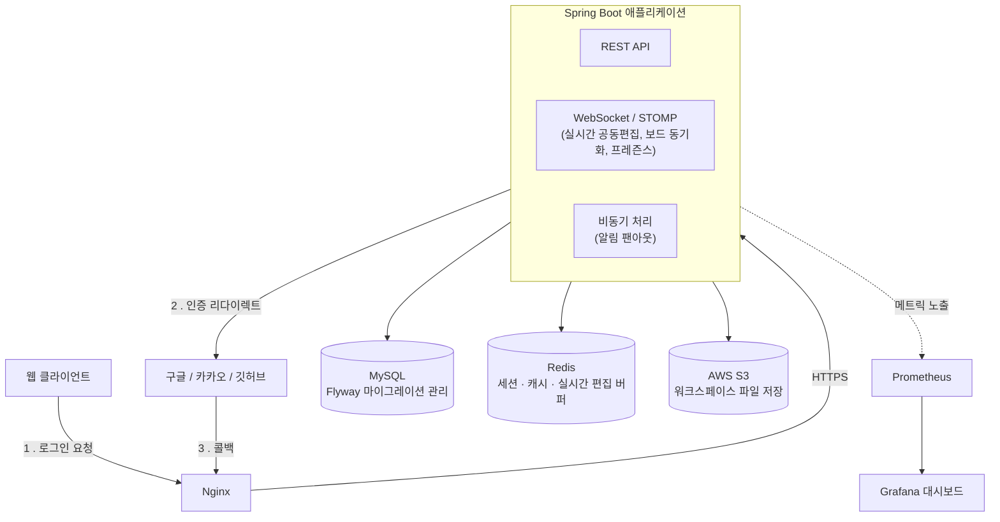
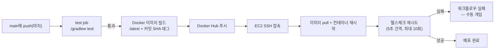

# MotivHub_BE

팀 단위 워크스페이스에서 태스크를 관리하고, 실시간 공동 편집·알림으로 함께 일하는 흐름을 지원하는 협업 툴의 백엔드입니다.

🔗 **배포 사이트**: https://motivhub.cloud

## 주요 기능

- **인증**: 소셜 로그인(구글/깃허브/카카오) + 이메일/비밀번호 로그인·회원가입(6자리 인증코드 방식), JWT 기반 멀티 디바이스 세션
- **워크스페이스**: 팀 생성/초대/멤버 관리, 권한(소유자/멤버) 기반 접근 제어
- **태스크 관리**: 상태·우선순위·기간 관리, 체크리스트, 댓글, 담당자·감시자 지정, 활동 로그
- **실시간 공동 편집**: Yjs(CRDT) 기반 태스크 노트 동시 편집, WebSocket(STOMP)으로 보드 변경사항·접속자 현황(프레즌스) 실시간 동기화
- **알림**: 담당자 지정/댓글/마감 임박 등 이벤트 기반 알림, 대량 발송 시 병목을 피하기 위한 비동기 팬아웃 처리
- **이슈 게시판**, **워크스페이스 파일 공유**(S3 호환 스토리지)
- **부하테스트 기반 성능 최적화**: k6로 부하를 주며 Grafana/Prometheus로 실시간 관측, 실측 기반으로 병목을 찾아 개선

## 기술 스택

| 구분 | 스택 |
|---|---|
| Backend | Spring Boot, Spring Security(OAuth2/JWT), Spring Data JPA, MySQL, Redis, Flyway |
| Infra | Docker Compose, Nginx, AWS S3(LocalStack), Prometheus, Grafana |
| Test | JUnit 5, Testcontainers, k6 |

## 아키텍처



## CI/CD

main에 머지되면 GitHub Actions가 테스트 → Docker 이미지 빌드/푸시 → EC2 배포까지 자동으로 수행합니다.



- PR에서는 `test` job만 실행됩니다 — 배포는 main에 직접 push(=머지)될 때만 트리거됩니다.
- 이미지 태그는 `:latest`와 커밋 SHA 둘 다 붙여서, 문제가 생기면 특정 커밋의 이미지로 수동 롤백할 수 있습니다.
- 자동 롤백은 없습니다 — 헬스체크가 실패하면 워크플로우가 실패 상태로 끝나고 직접 확인합니다.
- 워크플로우 정의: [`.github/workflows/ci.yml`](.github/workflows/ci.yml)

## 프로젝트 구조

도메인별 패키지(`com.motivhub.be.<domain>`) 안에서 `controller/service/repository/domain/dto/exception`으로
계층을 나누는 구조입니다. 진입점은 `MotivhubBeApplication.java`입니다.

```
com.motivhub.be
├── auth/                           # 인증/인가 — 소셜 로그인(OAuth2) + 이메일 인증코드 회원가입/로그인/비밀번호 재설정 + JWT
│   ├── config/
│   ├── controller/
│   ├── domain/
│   ├── dto/
│   ├── exception/
│   ├── handler/
│   ├── jwt/
│   ├── oauth/                      # 구글/깃허브/카카오/네이버(미사용)별 UserInfo 구현체
│   ├── repository/
│   └── service/
│
├── user/                           # 유저 프로필
│   ├── controller/
│   ├── domain/
│   ├── dto/
│   ├── exception/
│   ├── repository/
│   └── service/
│
├── workspace/                      # 워크스페이스/팀 — 생성·초대·멤버 권한 관리
│   ├── controller/
│   ├── domain/
│   ├── dto/
│   ├── event/
│   ├── exception/
│   ├── repository/
│   └── service/
│
├── task/                           # 태스크 — 가장 큰 도메인: 상태·우선순위·체크리스트·댓글·활동로그
│   ├── controller/
│   ├── domain/
│   ├── dto/
│   ├── event/
│   ├── exception/
│   ├── repository/
│   └── service/
│
├── issue/                          # 이슈 게시판
│   ├── controller/
│   ├── domain/
│   ├── dto/
│   ├── exception/
│   ├── repository/
│   └── service/
│
├── file/                           # 워크스페이스 파일 공유 (S3 presigned URL)
│   ├── controller/
│   ├── domain/
│   ├── dto/
│   ├── exception/
│   ├── repository/
│   └── service/
│
├── notification/                   # 알림 — 이벤트 기반 비동기 팬아웃
│   ├── config/
│   ├── controller/
│   ├── domain/
│   ├── dto/
│   ├── exception/
│   ├── repository/
│   └── service/
│
├── realtime/                       # WebSocket(STOMP) 기반 실시간 기능 — 공동편집, 보드 동기화, 프레즌스
│   ├── config/
│   ├── controller/
│   ├── dto/
│   ├── exception/
│   └── service/
│
├── dashboard/                      # 워크스페이스 대시보드(통계)
│   ├── controller/
│   ├── dto/
│   └── service/
│
└── global/                         # 공통 설정 · 예외 처리
    ├── config/
    └── exception/
```

## API 문서

로컬 실행 후 `http://localhost:8080/swagger-ui.html`에서 확인할 수 있습니다.

## 트러블슈팅

개발 중 겪은 문제와 원인·해결 과정은 [`docs/troubleshooting.md`](docs/troubleshooting.md)에 기록되어 있습니다.

---

## 로컬 실행

### 1. 환경 변수 설정

앱이 기동하려면 아래 환경 변수가 필요합니다. Spring Security가 기동 시점에 OAuth2 클라이언트 설정 값을 검증하므로, 로컬 개발에서는 실제 값이 아니어도 비어 있지 않은 임의의 문자열이면 됩니다.

- `JWT_SECRET`: 32자 이상의 임의 문자열
- `GOOGLE_CLIENT_ID`, `GOOGLE_CLIENT_SECRET`
- `GITHUB_CLIENT_ID`, `GITHUB_CLIENT_SECRET`
- `KAKAO_CLIENT_ID`, `KAKAO_CLIENT_SECRET`

### 2. 인프라 컨테이너 기동

```bash
docker compose up -d
```

MySQL, Redis, Prometheus, Grafana가 함께 기동됩니다. 기동 후 서비스 접속 정보는 다음과 같습니다.

- MySQL: `localhost:13306` (이 개발 환경에 이미 기본 포트(3306)를 쓰는 네이티브 MySQL이 있어 포트를 옮겼습니다)
- Redis: `localhost:6379`
- Prometheus UI: `localhost:9090`
- Grafana: `localhost:13000` (admin/admin) — 프런트엔드 개발 서버와의 기본 포트(3000) 충돌을 피하기 위해 옮겼습니다

### 3. 애플리케이션 실행

```bash
./gradlew bootRun
```

`localhost:8080`에서 앱이 실행됩니다.

> `/actuator/health`, `/actuator/prometheus`는 로컬 개발 편의를 위해 인증 없이 노출되어 있습니다. 실제 배포 환경에는 그대로 가져가면 안 됩니다.

### 4. (선택) 로컬에서 파일함 기능 손으로 테스트하기

`docker compose up -d`로 함께 뜨는 LocalStack(`localhost:4566`)이 S3를 흉내낸다. 버킷을 한 번 만들어야 한다:

```bash
docker compose exec localstack awslocal s3 mb s3://motivhub-local
```

앱을 아래 환경변수로 기동하면 파일함 API가 LocalStack을 보게 된다(자격증명 값은 아무 문자열이어도 됨 —
LocalStack은 검증하지 않는다):

```bash
AWS_S3_ENDPOINT_OVERRIDE=http://localhost:4566 AWS_S3_BUCKET=motivhub-local \
AWS_ACCESS_KEY_ID=test AWS_SECRET_ACCESS_KEY=test ./gradlew bootRun
```

