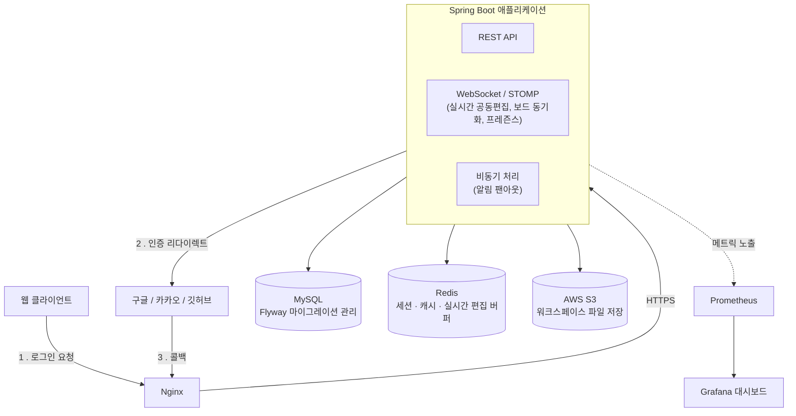

# MotivHub_BE

팀 단위 워크스페이스에서 태스크를 관리하고, 실시간 공동 편집·알림으로 함께 일하는 흐름을 지원하는 협업 툴의 백엔드입니다.

🔗 **배포 사이트**: https://motivhub.cloud

## 주요 기능

- **인증**: 소셜 로그인(구글/깃허브/카카오) + 이메일/비밀번호 로그인·회원가입(6자리 인증코드 방식), JWT 기반 멀티 디바이스 세션
- **워크스페이스**: 팀 생성/초대/멤버 관리, 권한(소유자/멤버) 기반 접근 제어
- **태스크 관리**: 상태·우선순위·기간 관리, 체크리스트, 댓글, 담당자·감시자 지정, 활동 로그
- **실시간 공동 편집**: Yjs(CRDT) 기반 태스크 노트 동시 편집, WebSocket(STOMP)으로 보드 변경사항·접속자 현황(프레즌스) 실시간 동기화
- **알림**: 담당자 지정/댓글/마감 임박 등 이벤트 기반 알림, 대량 발송 시 병목을 피하기 위한 비동기 팬아웃 처리
- **이슈 게시판**, **워크스페이스 파일 공유**(S3 호환 스토리지)
- **부하테스트 기반 성능 최적화**: k6로 부하를 주며 Grafana/Prometheus로 실시간 관측, 실측 기반으로 병목을 찾아 개선

## 기술 스택

| 구분 | 스택 |
|---|---|
| Backend | Spring Boot, Spring Security(OAuth2/JWT), Spring Data JPA, MySQL, Redis, Flyway |
| Infra | Docker Compose, Nginx, AWS S3(LocalStack), Prometheus, Grafana |
| Test | JUnit 5, Testcontainers, k6 |

## 아키텍처



## 프로젝트 구조

도메인별 패키지(`com.motivhub.be.<domain>`) 안에서 `controller/service/repository/domain/dto/exception`으로
계층을 나누는 구조입니다. 진입점은 `MotivhubBeApplication.java`이고, 아래는 도메인별 전체 파일 트리입니다.

```
com.motivhub.be
├── auth/                           # 인증/인가 — 소셜 로그인(OAuth2) + 이메일 인증코드 회원가입/로그인 + JWT
│   ├── config/
│   │   ├── RedisConfig.java
│   │   └── SecurityConfig.java
│   ├── controller/
│   │   └── AuthController.java
│   ├── domain/
│   │   └── EmailVerificationToken.java
│   ├── dto/
│   │   ├── ExchangeRequest.java
│   │   ├── LoginRequest.java
│   │   ├── RefreshRequest.java
│   │   ├── SignupCompleteRequest.java
│   │   ├── SignupRequestVerificationRequest.java
│   │   └── TokenPair.java
│   ├── exception/
│   │   ├── EmailAlreadyRegisteredException.java
│   │   ├── InvalidCodeException.java
│   │   ├── InvalidLoginException.java
│   │   ├── InvalidRefreshTokenException.java
│   │   ├── InvalidTokenException.java
│   │   ├── InvalidVerificationTokenException.java
│   │   ├── LogoutForbiddenException.java
│   │   ├── TooManyVerificationAttemptsException.java
│   │   ├── TooManyVerificationRequestsException.java
│   │   ├── VerificationCodeMismatchException.java
│   │   └── VerificationTokenExpiredException.java
│   ├── handler/
│   │   ├── OAuth2FailureHandler.java
│   │   └── OAuth2SuccessHandler.java
│   ├── jwt/
│   │   ├── JwtAuthenticationFilter.java
│   │   └── JwtProvider.java
│   ├── oauth/                      # 구글/깃허브/카카오/네이버(미사용)별 UserInfo 구현체
│   │   ├── CustomOAuth2User.java
│   │   ├── CustomOAuth2UserService.java
│   │   ├── GithubUserInfo.java
│   │   ├── GoogleUserInfo.java
│   │   ├── KakaoUserInfo.java
│   │   ├── NaverUserInfo.java
│   │   ├── OAuth2UserInfo.java
│   │   └── OAuth2UserInfoFactory.java
│   ├── repository/
│   │   └── EmailVerificationTokenRepository.java
│   └── service/
│       ├── AuthService.java
│       ├── EmailVerificationMailService.java
│       ├── RefreshTokenService.java
│       ├── SignupService.java
│       ├── TempAuthCodeService.java
│       └── VerificationAttemptLimiter.java    # Redis Lua 스크립트로 인증 시도 횟수를 원자적으로 제한
│
├── user/                           # 유저 프로필
│   ├── controller/
│   │   └── UserController.java
│   ├── domain/
│   │   ├── SocialProvider.java
│   │   ├── User.java
│   │   └── UserStatus.java
│   ├── dto/
│   │   ├── MyPageResponse.java
│   │   ├── NicknameCheckResponse.java
│   │   ├── NicknameUpdateRequest.java
│   │   ├── UserProfileResponse.java
│   │   └── UserSummary.java
│   ├── exception/
│   │   ├── InvalidNicknameException.java
│   │   ├── NicknameDuplicateException.java
│   │   └── UserNotFoundException.java
│   ├── repository/
│   │   └── UserRepository.java
│   └── service/
│       ├── NicknameValidator.java
│       ├── RandomNicknameGenerator.java
│       ├── UserRegistrationService.java
│       └── UserService.java
│
├── workspace/                      # 워크스페이스/팀 — 생성·초대·멤버 권한 관리
│   ├── controller/
│   │   ├── WorkspaceController.java
│   │   └── WorkspaceInviteController.java
│   ├── domain/
│   │   ├── Workspace.java
│   │   ├── WorkspaceInvite.java
│   │   ├── WorkspaceMember.java
│   │   └── WorkspaceRole.java
│   ├── dto/
│   │   ├── MemberSummary.java
│   │   ├── TransferOwnershipRequest.java
│   │   ├── WorkspaceCreateRequest.java
│   │   ├── WorkspaceDetailResponse.java
│   │   ├── WorkspaceInviteCreateRequest.java
│   │   ├── WorkspaceInviteResponse.java
│   │   ├── WorkspaceResponse.java
│   │   ├── WorkspaceTaskCounts.java
│   │   └── WorkspaceUpdateRequest.java
│   ├── event/
│   │   └── WorkspaceMemberRemovedEvent.java
│   ├── exception/
│   │   ├── InvalidInviteTokenException.java
│   │   ├── InviteExpiredException.java
│   │   ├── InviteRevokedException.java
│   │   ├── NotWorkspaceMemberException.java
│   │   ├── NotWorkspaceOwnerException.java
│   │   ├── WorkspaceLeaveRequiresTransferException.java
│   │   ├── WorkspaceMemberNotFoundException.java
│   │   └── WorkspaceNotFoundException.java
│   ├── repository/
│   │   ├── WorkspaceInviteRepository.java
│   │   ├── WorkspaceMemberCount.java
│   │   ├── WorkspaceMemberRepository.java
│   │   └── WorkspaceRepository.java
│   └── service/
│       ├── WorkspaceInviteMailService.java
│       ├── WorkspaceInviteService.java
│       └── WorkspaceService.java
│
├── task/                           # 태스크 — 가장 큰 도메인(~70개 파일): 상태·우선순위·체크리스트·댓글·활동로그
│   ├── controller/
│   │   ├── TaskChecklistItemController.java
│   │   ├── TaskCommentController.java
│   │   ├── TaskController.java
│   │   └── TaskNoteController.java
│   ├── domain/
│   │   ├── Task.java
│   │   ├── TaskActivityAction.java
│   │   ├── TaskActivityLog.java
│   │   ├── TaskAssignee.java
│   │   ├── TaskChecklistItem.java
│   │   ├── TaskComment.java
│   │   ├── TaskNote.java
│   │   ├── TaskPriority.java
│   │   ├── TaskStatus.java
│   │   └── TaskWatcher.java
│   ├── dto/
│   │   ├── MyTaskResponse.java
│   │   ├── TaskActivityLogResponse.java
│   │   ├── TaskAssigneeRequest.java
│   │   ├── TaskChecklistItemCreateRequest.java
│   │   ├── TaskChecklistItemResponse.java
│   │   ├── TaskChecklistItemUpdateRequest.java
│   │   ├── TaskCommentCreateRequest.java
│   │   ├── TaskCommentPromoteToIssueRequest.java    # 댓글 → 이슈 전환
│   │   ├── TaskCommentResponse.java
│   │   ├── TaskCommentUpdateRequest.java
│   │   ├── TaskContentUpdateRequest.java
│   │   ├── TaskCreateRequest.java
│   │   ├── TaskDetailResponse.java
│   │   ├── TaskNoteResponse.java
│   │   ├── TaskNoteUpdateRequest.java
│   │   ├── TaskPeriodUpdateRequest.java
│   │   ├── TaskPriorityUpdateRequest.java
│   │   ├── TaskResponse.java
│   │   ├── TaskStatusUpdateRequest.java
│   │   └── TaskYjsStateResponse.java
│   ├── event/
│   │   ├── AssigneeAddedEvent.java
│   │   ├── ChecklistCompletedEvent.java
│   │   ├── DueDateApproachingEvent.java
│   │   ├── TaskChangeType.java
│   │   ├── TaskChangedEvent.java
│   │   ├── TaskCommentCreatedEvent.java
│   │   └── TaskOverdueEvent.java
│   ├── exception/
│   │   ├── InvalidTaskStatusTransitionException.java
│   │   ├── TaskChecklistItemNotFoundException.java
│   │   ├── TaskCommentForbiddenException.java
│   │   ├── TaskCommentNotFoundException.java
│   │   ├── TaskEditForbiddenException.java
│   │   ├── TaskNotFoundException.java
│   │   └── TaskPeriodEditForbiddenException.java
│   ├── repository/
│   │   ├── MemberWorkloadCount.java
│   │   ├── TaskActivityLogRepository.java
│   │   ├── TaskAssigneeRepository.java
│   │   ├── TaskChecklistItemRepository.java
│   │   ├── TaskChecklistProgress.java
│   │   ├── TaskCommentRepository.java
│   │   ├── TaskNoteRepository.java
│   │   ├── TaskPriorityCount.java
│   │   ├── TaskRepository.java
│   │   ├── TaskStatusCount.java
│   │   └── TaskWatcherRepository.java
│   └── service/
│       ├── DueDateNotificationScheduler.java
│       ├── TaskAccessPolicy.java              # 담당자·소유자 기반 권한 정책
│       ├── TaskActivityLogService.java
│       ├── TaskChecklistItemService.java
│       ├── TaskCommentService.java
│       ├── TaskExpirationScheduler.java
│       ├── TaskNoteService.java
│       └── TaskService.java
│
├── issue/                          # 이슈 게시판
│   ├── controller/
│   │   ├── IssueCommentController.java
│   │   └── IssueController.java
│   ├── domain/
│   │   ├── Issue.java
│   │   └── IssueComment.java
│   ├── dto/
│   │   ├── IssueCommentCreateRequest.java
│   │   ├── IssueCommentResponse.java
│   │   ├── IssueCommentUpdateRequest.java
│   │   ├── IssueCreateRequest.java
│   │   ├── IssueResponse.java
│   │   └── IssueUpdateRequest.java
│   ├── exception/
│   │   ├── IssueCommentForbiddenException.java
│   │   ├── IssueCommentNotFoundException.java
│   │   ├── IssueForbiddenException.java
│   │   └── IssueNotFoundException.java
│   ├── repository/
│   │   ├── IssueCommentCount.java
│   │   ├── IssueCommentRepository.java
│   │   └── IssueRepository.java
│   └── service/
│       ├── IssueCommentService.java
│       └── IssueService.java
│
├── file/                           # 워크스페이스 파일 공유 (S3 presigned URL)
│   ├── controller/
│   │   └── WorkspaceFileController.java
│   ├── domain/
│   │   └── WorkspaceFile.java
│   ├── dto/
│   │   ├── FileDownloadResponse.java
│   │   ├── FilePresignRequest.java
│   │   ├── FilePresignResponse.java
│   │   ├── WorkspaceFileCategoryUpdateRequest.java
│   │   ├── WorkspaceFileConfirmRequest.java
│   │   └── WorkspaceFileResponse.java
│   ├── exception/
│   │   ├── BlockedFileExtensionException.java
│   │   ├── FileTooLargeException.java
│   │   ├── FileUploadNotConfirmedException.java
│   │   ├── WorkspaceFileForbiddenException.java
│   │   └── WorkspaceFileNotFoundException.java
│   ├── repository/
│   │   └── WorkspaceFileRepository.java
│   └── service/
│       └── WorkspaceFileService.java          # S3 presigned URL 발급/확정
│
├── notification/                   # 알림 — 이벤트 기반 비동기 팬아웃
│   ├── config/
│   │   └── NotificationAsyncConfig.java       # 전용 비동기 스레드풀
│   ├── controller/
│   │   └── NotificationController.java
│   ├── domain/
│   │   ├── Notification.java
│   │   ├── NotificationSetting.java
│   │   ├── NotificationTargetType.java
│   │   └── NotificationType.java
│   ├── dto/
│   │   ├── NotificationResponse.java
│   │   ├── NotificationSettingResponse.java
│   │   ├── NotificationSettingUpdateRequest.java
│   │   └── UnreadCountResponse.java
│   ├── exception/
│   │   └── NotificationNotFoundException.java
│   ├── repository/
│   │   ├── NotificationRepository.java
│   │   └── NotificationSettingRepository.java
│   └── service/
│       ├── NotificationEventListener.java     # 이벤트 기반 비동기 팬아웃
│       └── NotificationService.java
│
├── realtime/                       # WebSocket(STOMP) 기반 실시간 기능 — 공동편집, 보드 동기화, 프레즌스
│   ├── config/
│   │   ├── RealtimeDestinations.java
│   │   ├── StompPrincipal.java
│   │   ├── TaskTopicChannelInterceptor.java
│   │   └── WebSocketConfig.java
│   ├── controller/
│   │   └── TaskEditRelayController.java
│   ├── dto/
│   │   ├── TaskBoardChangeMessage.java
│   │   ├── TaskChangedMessage.java
│   │   ├── TaskEditReplayMessage.java
│   │   ├── TaskEditSaveRequestSignal.java
│   │   ├── TaskEditSnapshotMessage.java
│   │   ├── TaskEditUpdateMessage.java
│   │   └── TaskPresenceMessage.java
│   ├── exception/
│   │   └── StompAuthenticationException.java
│   └── service/
│       ├── PresenceService.java
│       ├── TaskBoardBroadcaster.java
│       ├── TaskChangeBroadcaster.java
│       ├── TaskEditAutosaveScheduler.java     # CRDT 공동편집 자동저장
│       ├── TaskEditBufferReplayListener.java
│       ├── TaskEditBufferService.java         # CRDT 공동편집 버퍼링
│       ├── TaskEditChannelRegistry.java
│       ├── TaskEditLastViewerFlushListener.java
│       ├── TaskEditableField.java
│       ├── TaskPresenceEventListener.java
│       └── WorkspaceMemberRemovedSessionCleaner.java
│
├── dashboard/                      # 워크스페이스 대시보드(통계)
│   ├── controller/
│   │   └── DashboardController.java
│   ├── dto/
│   │   └── DashboardStatsResponse.java
│   └── service/
│       └── DashboardService.java
│
└── global/                         # 공통 설정 · 예외 처리
    ├── config/
    │   ├── FrontendUrls.java
    │   ├── JacksonConfig.java
    │   ├── OpenApiConfig.java
    │   └── S3Config.java
    └── exception/
        ├── ErrorResponse.java
        ├── GlobalExceptionHandler.java
        └── JwtAuthenticationEntryPoint.java
```

## API 문서

로컬 실행 후 `http://localhost:8080/swagger-ui.html`에서 확인할 수 있습니다.

## 트러블슈팅

개발 중 겪은 문제와 원인·해결 과정은 [`docs/troubleshooting.md`](docs/troubleshooting.md)에 기록되어 있습니다.

---

## 로컬 실행

### 1. 환경 변수 설정

앱이 기동하려면 아래 환경 변수가 필요합니다. Spring Security가 기동 시점에 OAuth2 클라이언트 설정 값을 검증하므로, 로컬 개발에서는 실제 값이 아니어도 비어 있지 않은 임의의 문자열이면 됩니다.

- `JWT_SECRET`: 32자 이상의 임의 문자열
- `GOOGLE_CLIENT_ID`, `GOOGLE_CLIENT_SECRET`
- `GITHUB_CLIENT_ID`, `GITHUB_CLIENT_SECRET`
- `KAKAO_CLIENT_ID`, `KAKAO_CLIENT_SECRET`

### 2. 인프라 컨테이너 기동

```bash
docker compose up -d
```

MySQL, Redis, Prometheus, Grafana가 함께 기동됩니다. 기동 후 서비스 접속 정보는 다음과 같습니다.

- MySQL: `localhost:13306` (이 개발 환경에 이미 기본 포트(3306)를 쓰는 네이티브 MySQL이 있어 포트를 옮겼습니다)
- Redis: `localhost:6379`
- Prometheus UI: `localhost:9090`
- Grafana: `localhost:13000` (admin/admin) — 프런트엔드 개발 서버와의 기본 포트(3000) 충돌을 피하기 위해 옮겼습니다

### 3. 애플리케이션 실행

```bash
./gradlew bootRun
```

`localhost:8080`에서 앱이 실행됩니다.

> `/actuator/health`, `/actuator/prometheus`는 로컬 개발 편의를 위해 인증 없이 노출되어 있습니다. 실제 배포 환경에는 그대로 가져가면 안 됩니다.

### 4. (선택) 로컬에서 파일함 기능 손으로 테스트하기

`docker compose up -d`로 함께 뜨는 LocalStack(`localhost:4566`)이 S3를 흉내낸다. 버킷을 한 번 만들어야 한다:

```bash
docker compose exec localstack awslocal s3 mb s3://motivhub-local
```

앱을 아래 환경변수로 기동하면 파일함 API가 LocalStack을 보게 된다(자격증명 값은 아무 문자열이어도 됨 —
LocalStack은 검증하지 않는다):

```bash
AWS_S3_ENDPOINT_OVERRIDE=http://localhost:4566 AWS_S3_BUCKET=motivhub-local \
AWS_ACCESS_KEY_ID=test AWS_SECRET_ACCESS_KEY=test ./gradlew bootRun
```

